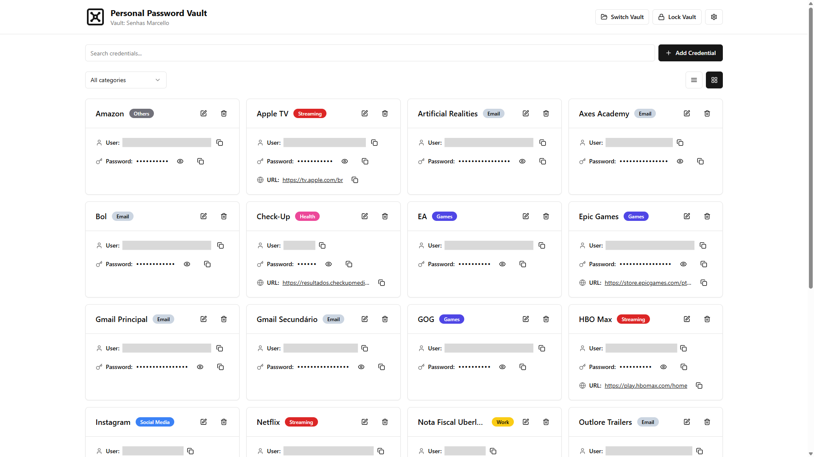

<h1 align="center">Personal Password Vault – Offline-First Password Manager</h1>

<div align="center">

[]()


[](./LICENSE)

</div>

<div align="center">



</div>

## Description

A client-side password vault application that stores credentials in encrypted local files. Uses AES-256-GCM encryption via the Web Crypto API to secure passwords with a master password. Data never leaves the browser — vaults are saved as `.vault` files directly to the file system using the File System Access API.

## Features

- Create encrypted vault files protected by a master password
- Open and manage multiple vault files
- Store credentials with name, username, password, URL, notes, and category
- Organize credentials into 10 categories (Email, Social, Work, Banking, Shopping, Streaming, Games, Education, Health, Others)
- Search and filter credentials by text or category
- Copy username, password, or URL to clipboard with one click
- Toggle password visibility per credential
- Auto-lock vault after configurable period of inactivity
- Switch between light, dark, and system theme modes
- Multilingual interface (i18n support)

## Tech Stack

**Frontend**
- Next.js 16.2 (React 19, TypeScript 5)
- Tailwind CSS 3.4
- Radix UI primitives (shadcn/ui components)
- Lucide React icons
- Sonner toast notifications

**Security**
- Web Crypto API (AES-256-GCM encryption)
- PBKDF2 key derivation (100,000 iterations)
- File System Access API for local file persistence
- IndexedDB for application settings storage

**Tooling**
- Biome (linting)
- pnpm (package management)

## Getting Started

### Prerequisites

- **Node.js 18+** (required for Next.js 16)
- **Modern Chromium-based browser** (Chrome 86+, Edge 86+, Opera 72+, or Brave)
- The File System Access API is required for vault file operations

### Installation

```bash
# Clone the repository
git clone https://github.com/MllGll/personal-password-vault.git
cd personal-password-vault

# Install dependencies
pnpm install
```

### Running the Project

```bash
# Start development server
pnpm dev

# Build for production
pnpm build

# Start production server
pnpm start
```

The development server will start at `http://localhost:3000`.

## Available Scripts

| Script | Description |
|--------|-------------|
| `pnpm dev` | Start Next.js development server with hot reload |
| `pnpm build` | Build optimized production bundle |
| `pnpm start` | Start production server (requires build first) |
| `pnpm lint` | Run Biome linter on codebase |

## Browser Compatibility

This application requires browser support for the File System Access API:

| Browser | Minimum Version |
|---------|-----------------|
| Chrome | 86+ |
| Edge | 86+ |
| Opera | 72+ |
| Brave | All versions |

**Not supported:** Firefox, Safari (File System Access API unavailable)

## Project Structure

```
├── app/                    # Next.js app directory
│   ├── i18n/              # Internationalization (i18next)
│   ├── globals.css        # Global styles
│   ├── layout.tsx         # Root layout
│   ├── page.tsx           # Main application component
│   └── demo-screen.png    # Screenshot for README
├── components/             # React components
│   ├── modals/            # Dialog components (CreateVault, OpenVault, etc.)
│   └── ui/                # shadcn/ui base components
├── lib/                   # Core utilities
│   ├── crypto.ts          # Web Crypto API encryption/decryption
│   ├── storage.ts         # IndexedDB settings manager
│   └── vault.ts           # File System Access API vault operations
├── types/                 # TypeScript type definitions
├── public/                # Static assets
├── next.config.mjs        # Next.js configuration
├── tailwind.config.ts     # Tailwind CSS configuration
└── tsconfig.json          # TypeScript configuration
```

## Security Considerations

- Vault files use AES-256-GCM encryption with randomly generated salts and IVs
- Master passwords are never stored; they derive encryption keys via PBKDF2
- Sensitive data is cleared from memory when the vault locks
- Auto-lock timer resets on user activity (mouse, keyboard, scroll, touch)
- All cryptographic operations use the browser's native Web Crypto API

## Support

For bug reports and feature requests, please use [GitHub Issues](https://github.com/MllGll/personal-password-vault/issues).

**Direct contact:**

Marcello Gallante  
Email: [marcellogallante@gmail.com](mailto:marcellogallante@gmail.com)

## Authors

**Marcello Gallante**

- GitHub: [https://github.com/MllGll](https://github.com/MllGll)

## License

This project is licensed under the MIT License. See [LICENSE](./LICENSE) for details.
